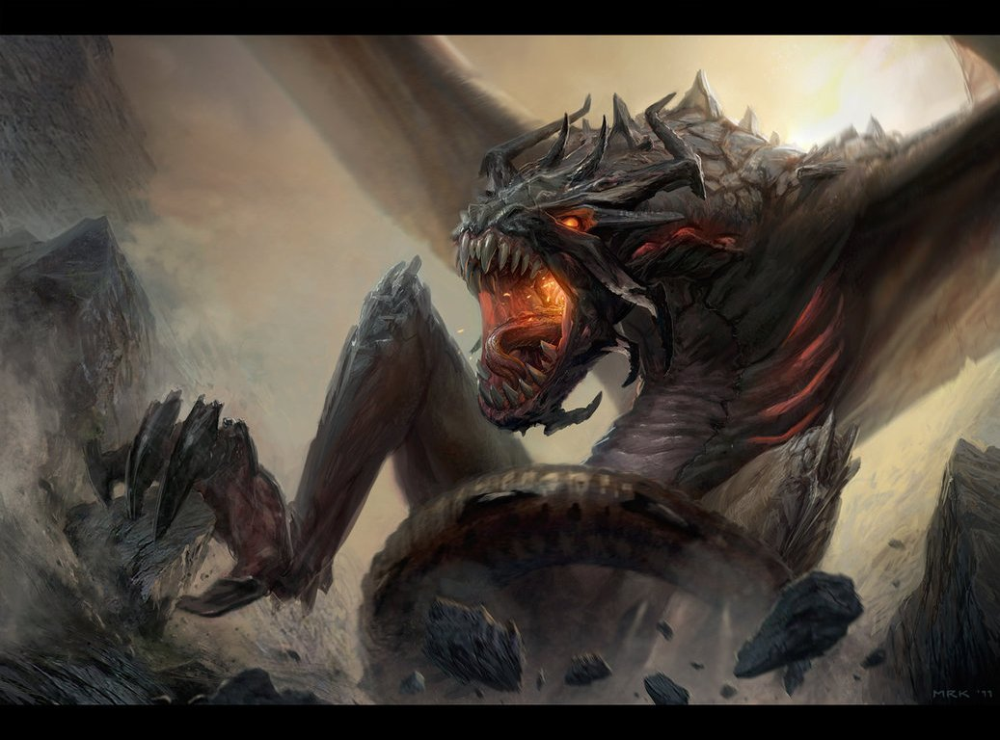

# Anwar's Codex Cave

Once upon a very specific machine, in a kingdom with too many terminals and not
enough clean scrollback, Anwar placed a small heap of notes, incantations,
abandoned breadcrumbs, and suspiciously labeled cupboards into a repo.

The repo was not born under a comet. It was not announced at a conference. It
did not receive a logo pack, a launch plan, a product requirements document, or
even the dignity of pretending to be generally applicable. It appeared, as many
local things appear, because one person had a problem, then another problem,
then a third problem that looked enough like the first two that putting the
evidence somewhere seemed less foolish than losing it again.

A traveler came upon the repo and said, "Surely this is a reusable framework."

The repo replied, "No."

The traveler said, "Perhaps it is a product."

The repo replied, "Absolutely not."

The traveler said, "Then it must be documentation."

At this, the air behind the shell scripts split open like a burned curtain, and
a dragon unfolded from the dark. Its horns scraped the ceiling. Its eyes held
the tired red glow of a production alert that had learned patience. Around its
neck hung a cracked iron tag engraved `local context`.



The dragon was ancient in the way abandoned workarounds are ancient: not noble,
not elegant, just present long enough that removing it without understanding it
would probably summon consequences. Its scales were the color of old terminal
glass. Its breath smelled faintly of overheated laptops, stale coffee, and a
shell history that should never be printed.

"Listen carefully," said the dragon, and the prompt dimmed. "I shall now
provide a warning that resembles guidance only from a dangerous distance."

"This place is purely for Anwar."

"Not Anwar-in-the-abstract. Not Anwar-as-a-design-pattern. Not Anwar-compatible
humans. Anwar."

"It is not intended as a sharable anything. It is not a template. It is not a
starter kit. It is not a toolkit. It is not a framework. It is not a philosophy.
It is not an argument. It is not a recommendation. It is not a best practice.
It is not a worst practice either, though the distinction may become difficult
after midnight."

The traveler, being the sort of traveler who had already ignored a dragon made
of smoke, ash, and local state, opened a notebook with trembling optimism.

"Could one at least infer the architecture?"

"One could infer many things," said the dragon, "in the same way one could infer
the weather from a sandwich. The inference would be vivid, possibly sincere,
and of limited operational value."

"Could one copy the structure?"

"One could also copy a bird's nest by stapling twigs to a bicycle. The result
would be structurally confident and spiritually alarming."

"Could one search the repo for truth?"

The dragon looked toward a corridor marked `durable`, then toward another
marked `sessions`, then toward a small locked cupboard that hummed with the low
confidence of something that knew too much.

"Truth is a strong word," said the dragon. "There are artifacts. There are
echoes. There are notes written by agents under time pressure. There are local
tools with names that once seemed obvious. There are memories, plans, reviews,
and the occasional file that exists because a previous afternoon was more
complicated than expected. Some of these things are useful to Anwar. That is the
complete design brief."

The traveler frowned.

"But every repo should have onboarding."

"This is offboarding," said the dragon. "The intended user journey is that you
arrive, read this, feel the sensible part of your mind step backward, and leave
with your day intact."

The traveler pointed at the paths.

"These look organized."

"Many hazards do," said the dragon. "A neatly labeled cabinet can still contain
a single glove, four obsolete keys, and a handwritten reminder to investigate a
thing that no longer exists. Organization is not invitation. A fence may be
well painted and still mean 'do not climb this fence.'"

The traveler tried again.

"If it is not reusable, why is it in git?"

The dragon's eyes narrowed, and the cave grew warmer. This was its favorite
kind of question: one with an answer that explained nothing useful and took
several futures as collateral.

"Because local history is helpful to the local person. Because the machine may
change. Because a note can be wrong and still worth preserving long enough to
be corrected. Because one day someone will ask 'where did that thing go?' and
the answer 'somewhere in a terminal buffer from Tuesday' will not satisfy even
the most patient soul."

"So it is a personal archive?"

"Closer."

"A workspace?"

"Warmer."

"A portable memory palace?"

"Please stop."

The dragon unfurled one wing. The membrane was scarred with old branch names,
half-remembered fixes, and the silhouettes of decisions that had once seemed
urgent. Beneath it hung a sign painted in regrettably official lettering:

```text
PROCEED AT YOUR OWN RISK
NO MAPS WILL BE ISSUED
NO MAPS WOULD HELP
```

Below the sign, in smaller letters, someone had added:

```text
IF YOU THINK YOU HAVE FOUND A PATTERN,
PLEASE SET IT DOWN GENTLY AND BACK AWAY.
```

The traveler was not deterred.

"What if I need to understand how this works?"

"Then you have my sympathy," said the dragon, which was not the same as help.

"What if I need to use it?"

"Then you are probably Anwar, or you have taken a wrong turn in a very specific
forest."

"What if I am an automated agent?"

The dragon exhaled. Somewhere far away, a terminal bell rang for no visible
reason.

"Then read the local instructions before touching anything, do not print
secrets, do not generalize from one weird local convention into a universal
truth, and remember that a file being present is not the same as a file being a
promise."

The traveler wrote this down.

"That sounds like useful guidance."

"Then you have misheard it," said the dragon.

The repo shifted slightly. Somewhere deep inside, a plan file remembered a
decision. Somewhere else, a tool logged only the harmless parts of an
invocation and buried the rest where raw evidence belongs. A memory summary
rearranged itself with the air of a locked archive pretending not to breathe.

"Surely," said the traveler, "there must be one sentence that explains the
whole place."

The dragon considered this.

"Very well."

It cleared its throat.

"This repo is a personal pile of Anwar-specific Codex state, durable artifacts,
local tools, and remembered workflow scars, kept in git so the pile has a
timeline."

The traveler took one hopeful step forward. "That is actually quite clear."

"Then it is too dangerous to leave intact," said the dragon.

The dragon ate the sentence.

In its place, the README now offers the following extremely important fable
morals:

1. If you are not Anwar, this is not for you.
2. If you are Anwar, this is still barely for you.
3. If something here looks reusable, that may be a trick of the smoke.
4. If something here looks authoritative, check whether it was written during a
   Tuesday incident investigation before believing it.
5. If a directory name seems to promise clarity, remember that dragons also
   label things.
6. If you feel the urge to turn this into a platform, drink water and lie down.
7. If you came seeking best practices, you have entered the wrong cave and the
   cave knows.
8. If you came seeking mysteries, the mysteries have already noticed you.
9. If you came seeking a dragon, lower your expectations and your lantern.

The traveler closed the notebook.

"So there is nothing for me here?"

"There may be many things here," said the dragon, "but almost none of them are
improved by you knowing about them."

"And if I proceed anyway?"

"Then proceed at your own risk."

"What is the risk?"

The dragon gestured to the repo with a claw long enough to point at several
mistakes at once.

"Context."

At this, the traveler finally understood, or at least became afraid in a useful
direction. They backed away slowly, which is the safest speed at which to leave
a directory containing both shell scripts and memories.

The dragon watched them go, then returned to its hoard: a careful stack of
local-only facts, one-off tools, redacted examples, tactical notes, and small
decisions that would be baffling if removed from the exact machine on which
they were made.

And the repo was quiet again.

For almost four minutes.

Then another traveler arrived and asked whether it supported plugins.

The dragon opened one eye. The cave lights went out.

And the fable began again.
